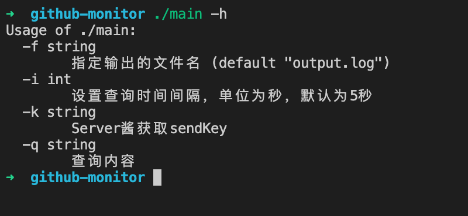
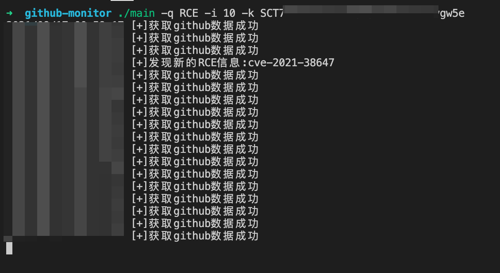
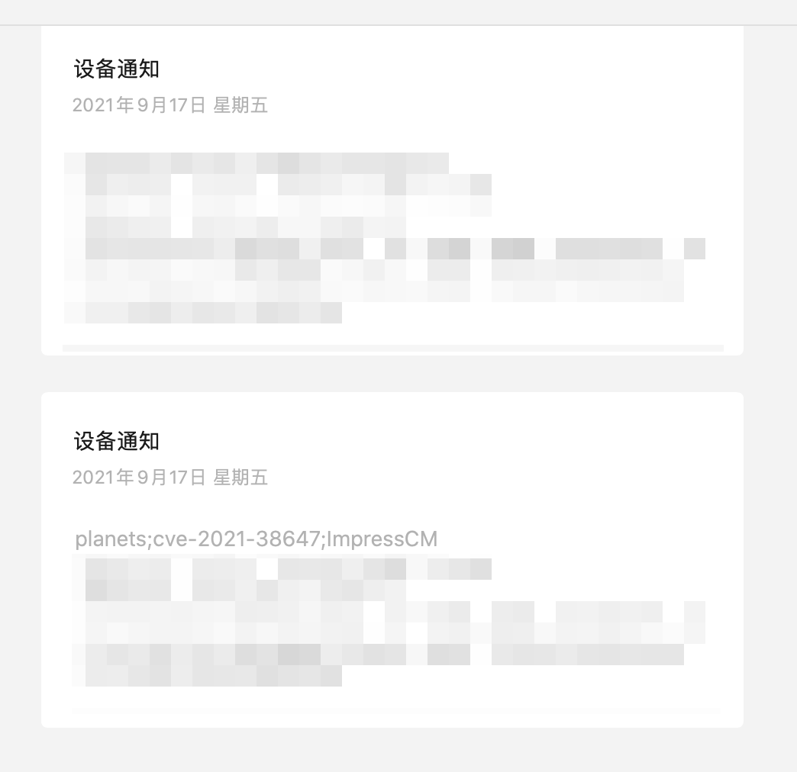

# GITHUB内容更新推送到微信上

利用github的API实时查询最新内容，通过server酱推送到微信上。

1. 首先需要在server酱去获取sendKey

[Server酱](https://sct.ftqq.com/sendkey)

2. 通过本库的来查询和推送



3. 运行效果





### Usage

```bash
./main -q <检索内容> -i <间隔时间> -k <server酱sendKey> -f <output.log>

```